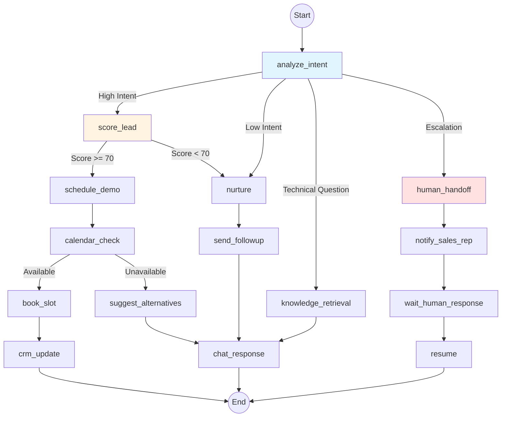
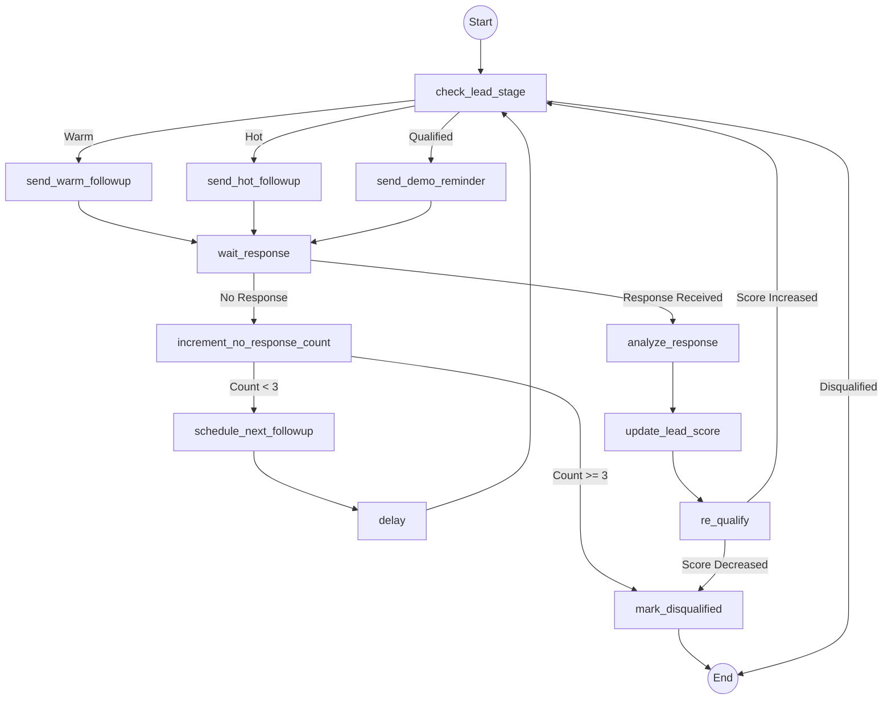
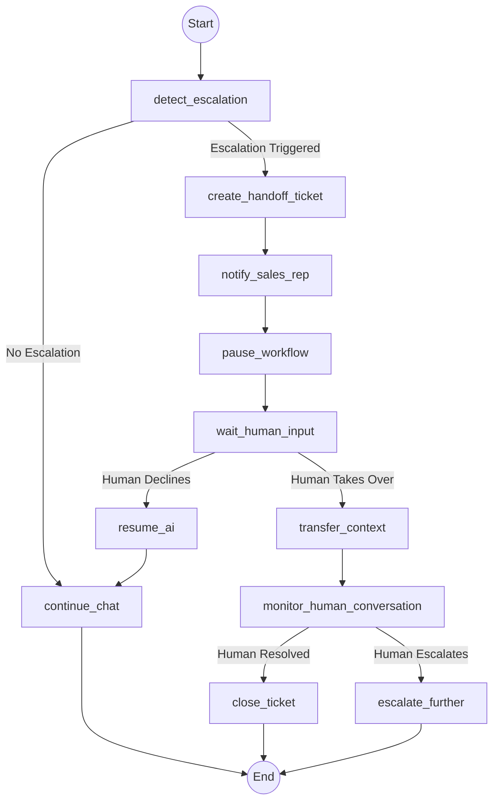

# Sales Agent: LangGraph Migration Analysis

## Executive Summary

This document provides a comprehensive architectural analysis of migrating the current Sales Agent to a LangGraph-based workflow. After evaluating the current implementation, sales use case requirements, and LangGraph capabilities, **I recommend a hybrid approach**: keep the current simple agent architecture for basic conversations, but introduce LangGraph for complex multi-step workflows like lead qualification, follow-up sequences, and human handoff scenarios.

---

## Table of Contents

1. [Current Architecture Analysis](#current-architecture-analysis)
2. [LangGraph Benefits for Sales Use Cases](#langgraph-benefits-for-sales-use-cases)
3. [Complexity Trade-offs](#complexity-trade-offs)
4. [Architectural Recommendation](#architectural-recommendation)
5. [LangGraph Workflow Design](#langgraph-workflow-design)
6. [Migration Strategy](#migration-strategy)
7. [Conclusion](#conclusion)

---

## Current Architecture Analysis

### Current Implementation

The current Sales Agent uses a **simple sequential agent architecture**:

```
User Message → Load History → RAG Retrieval → Prompt Building → LLM Call → Guardrails → Memory Save → Response
```

**Key Components:**

- **AgentService**: Orchestrates the conversation flow sequentially
- **RAGService**: Retrieves relevant knowledge from PostgreSQL + pgvector
- **MemoryService**: Manages conversation history in Redis
- **PromptBuilder**: Dynamically builds system prompts with persona, tone, and knowledge
- **GuardrailsService**: Validates responses for safety and confidence
- **LeadScorer**: Updates lead scores based on signal detection (pricing, availability, budget, booking intent)
- **HumanBehaviorService**: Simulates human-like delays and behaviors

**Strengths:**

1. **Simplicity**: Linear flow is easy to understand, debug, and maintain
2. **Performance**: Sequential execution with minimal overhead
3. **Predictability**: Deterministic behavior with clear error handling
4. **Clean Architecture**: Well-separated concerns with dependency injection
5. **Production Ready**: Comprehensive infrastructure (PostgreSQL, Redis, RabbitMQ, Prometheus)

**Limitations:**

1. **No Branching Logic**: Cannot conditionally execute different paths based on conversation state
2. **No Human-in-the-Loop**: Escalation triggers are detected but not integrated into workflow
3. **No Multi-Step Workflows**: Cannot handle complex sequences like "qualify → schedule → follow-up"
4. **No State Persistence**: Conversation state is not checkpointed for resumption
5. **No Tool Calling**: Cannot dynamically invoke external tools (CRM, calendar, email)
6. **Limited Orchestration**: All logic is hardcoded in AgentService

---

## LangGraph Benefits for Sales Use Cases

### 1. Stateful Conversation Management

**Current Problem:** Conversation state is lost if the process crashes or needs to resume.

**LangGraph Solution:** Built-in checkpointing with `AsyncPostgresSaver` persists conversation state at each node, enabling:
- Resume interrupted conversations
- Time-travel debugging
- State inspection and rollback
- Multi-turn workflows with context preservation

**Sales Impact:** Critical for long sales cycles where conversations span days/weeks.

### 2. Conditional Branching

**Current Problem:** Cannot route conversations based on lead quality, intent, or escalation triggers.

**LangGraph Solution:** Conditional edges enable dynamic routing:
- Route high-intent leads to scheduling workflow
- Route low-intent leads to nurturing workflow
- Route escalation requests to human handoff
- Route technical questions to specialized knowledge retrieval

**Sales Impact:** Enables intelligent conversation routing based on real-time lead scoring.

### 3. Multi-Agent Orchestration

**Current Problem:** Single agent handles all tasks, limiting specialization.

**LangGraph Solution:** Multi-agent graphs with specialized nodes:
- **Lead Qualification Agent**: Focuses on scoring and qualification
- **Product Knowledge Agent**: Handles product-specific questions
- **Scheduling Agent**: Manages calendar and booking
- **Nurturing Agent**: Sends follow-up sequences
- **Human Handoff Agent**: Manages escalation to sales reps

**Sales Impact:** Each agent specializes in its domain, improving accuracy and efficiency.

### 4. Tool Calling Integration

**Current Problem:** Cannot dynamically invoke external systems (CRM, calendar, email).

**LangGraph Solution:** Native tool calling with LangChain:
- Query CRM for lead history
- Check calendar availability
- Send email follow-ups
- Update lead status in external systems
- Fetch real-time pricing/inventory

**Sales Impact:** Enables true sales automation with system integration.

### 5. Human-in-the-Loop Workflows

**Current Problem:** Escalation triggers are detected but not integrated into workflow.

**LangGraph Solution:** Interrupt nodes enable human intervention:
- Pause workflow for human review
- Collect human feedback
- Resume workflow with human input
- Audit trail of human decisions

**Sales Impact:** Seamless handoff between AI and human sales reps.

### 6. Observability and Debugging

**Current Problem:** Limited visibility into decision-making process.

**LangGraph Solution:** Built-in tracing and state inspection:
- Visual graph execution
- State snapshots at each node
- Decision path logging
- Langfuse integration for LLM tracing

**Sales Impact:** Better understanding of why leads are qualified/rejected.

---

## Complexity Trade-offs

### Increased Complexity

| Aspect | Current | With LangGraph | Impact |
|--------|---------|----------------|--------|
| **Codebase Size** | ~90 lines (AgentService) | ~300-500 lines (graph + nodes) | +3-5x |
| **Learning Curve** | Simple sequential logic | Graph concepts, state management | Medium |
| **Debugging** | Linear stack traces | Graph execution traces | Medium |
| **Testing** | Unit tests per service | Graph integration tests | High |
| **Deployment** | Single service | Graph compilation + checkpointing | Low-Medium |
| **Monitoring** | Standard metrics | Graph-specific metrics | Medium |

### Mitigation Strategies

1. **Incremental Migration**: Start with simple workflows, add complexity gradually
2. **Hybrid Architecture**: Keep simple agent for basic chat, use LangGraph for complex workflows
3. **Abstraction Layers**: Wrap LangGraph in service layer to hide complexity
4. **Testing Framework**: Invest in graph testing utilities early
5. **Documentation**: Document graph structure and decision logic

### When Complexity is Worth It

**LangGraph is worth the complexity when:**
- You need multi-step workflows (qualification → scheduling → follow-up)
- You need human-in-the-loop integration
- You need conditional routing based on lead state
- You need tool calling for CRM/calendar integration
- You need state persistence for long sales cycles

**LangGraph is NOT worth the complexity when:**
- Simple Q&A conversations only
- No external system integration needed
- No human handoff required
- Linear conversation flow is sufficient
- Team lacks LangGraph expertise

---

## Architectural Recommendation

### Recommended Approach: Hybrid Architecture

**For the Sales Agent, I recommend a hybrid architecture:**

```
┌─────────────────────────────────────────────────────────────┐
│                    API Layer (FastAPI)                      │
├─────────────────────────────────────────────────────────────┤
│                    Conversation Router                       │
│         (Routes to Simple Agent or LangGraph Workflow)      │
├──────────────────────┬──────────────────────────────────────┤
│   Simple Agent       │        LangGraph Workflows           │
│   (Current)          │                                        │
│   - Basic Q&A        │   - Lead Qualification Workflow       │
│   - RAG Knowledge    │   - Scheduling Workflow               │
│   - Guardrails       │   - Follow-up Sequence Workflow       │
│   - Memory           │   - Human Handoff Workflow            │
└──────────────────────┴──────────────────────────────────────┘
```

### Decision Matrix

| Use Case | Recommended Architecture | Rationale |
|----------|-------------------------|-----------|
| **Basic Product Q&A** | Simple Agent | Linear flow, no branching needed |
| **Lead Qualification** | LangGraph Workflow | Multi-step: score → qualify → route |
| **Scheduling/Booking** | LangGraph Workflow | Tool calling + calendar integration |
| **Follow-up Sequences** | LangGraph Workflow | Multi-step with delays + state persistence |
| **Human Handoff** | LangGraph Workflow | Interrupt nodes + human-in-the-loop |
| **Technical Support** | Simple Agent | Knowledge retrieval is sufficient |
| **Pricing Negotiation** | LangGraph Workflow | Conditional logic + CRM integration |

### Implementation Phases

**Phase 1: Foundation (Weeks 1-2)**
- Keep current simple agent for basic conversations
- Add LangGraph dependency
- Set up `AsyncPostgresSaver` for checkpointing
- Create basic graph structure with chat node only

**Phase 2: Lead Qualification Workflow (Weeks 3-4)**
- Implement lead qualification graph:
  - Chat node (conversation)
  - Score node (lead scoring)
  - Qualify node (qualification logic)
  - Route node (conditional routing)
- Test with real leads
- Monitor performance vs simple agent

**Phase 3: Scheduling Workflow (Weeks 5-6)**
- Implement scheduling graph with tool calling:
  - Calendar availability check
  - Booking confirmation
  - CRM integration
- Integrate with lead qualification workflow

**Phase 4: Human Handoff (Weeks 7-8)**
- Implement interrupt nodes for escalation
- Add human feedback collection
- Resume workflow after human intervention
- Audit trail for compliance

**Phase 5: Follow-up Sequences (Weeks 9-10)**
- Implement delayed follow-up workflows
- State persistence across days/weeks
- Multi-channel outreach (email, SMS, chat)

---

## LangGraph Workflow Design

### Workflow 1: Lead Qualification Graph



**Nodes:**

1. **`analyze_intent`**: Classifies user intent (high intent, low intent, technical, escalation)
2. **`score_lead`**: Updates lead score based on conversation signals
3. **`knowledge_retrieval`**: RAG retrieval for technical questions
4. **`schedule_demo`**: Initiates demo scheduling workflow
5. **`calendar_check`**: Checks calendar availability via tool calling
6. **`book_slot`**: Books meeting slot via tool calling
7. **`crm_update`**: Updates lead status in CRM via tool calling
8. **`nurture`**: Adds lead to nurturing sequence
9. **`send_followup`**: Sends follow-up message via tool calling
10. **`human_handoff`**: Interrupts workflow for human intervention
11. **`notify_sales_rep`**: Notifies sales rep via WebSocket/email
12. **`wait_human_response`**: Pauses workflow for human input
13. **`resume`**: Resumes workflow with human feedback
14. **`chat_response`**: Generates final response to user

**State Schema:**

```python
from typing import TypedDict, Literal

class LeadQualificationState(TypedDict):
    messages: list[BaseMessage]
    lead_id: str
    lead_score: int
    lead_stage: Literal["cold", "warm", "hot", "qualified"]
    intent: Literal["high_intent", "low_intent", "technical", "escalation"]
    calendar_available: bool | None
    meeting_booked: bool
    human_handoff: bool
    human_feedback: str | None
    next_followup_date: str | None
```

### Workflow 2: Follow-up Sequence Graph



**Nodes:**

1. **`check_lead_stage`**: Checks current lead stage
2. **`send_warm_followup`**: Sends warm lead follow-up message
3. **`send_hot_followup`**: Sends hot lead follow-up message
4. **`send_demo_reminder`**: Sends demo reminder
5. **`wait_response`**: Waits for customer response (with timeout)
6. **`analyze_response`**: Analyzes customer response sentiment
7. **`increment_no_response_count`**: Tracks no-response count
8. **`schedule_next_followup`**: Schedules next follow-up with delay
9. **`delay`**: Implements delay between follow-ups
10. **`update_lead_score`**: Updates lead score based on response
11. **`re_qualify`**: Re-evaluates lead qualification
12. **`mark_disqualified`**: Marks lead as disqualified

### Workflow 3: Human Handoff Graph



**Nodes:**

1. **`detect_escalation`**: Detects escalation keywords in user message
2. **`create_handoff_ticket`**: Creates handoff ticket in system
3. **`notify_sales_rep`**: Notifies sales rep via WebSocket/email
4. **`pause_workflow`**: Interrupts workflow for human intervention
5. **`wait_human_input`**: Waits for human to accept/decline
6. **`transfer_context`**: Transfers conversation context to human
7. **`monitor_human_conversation`**: Monitors human conversation progress
8. **`resume_ai`**: Resumes AI conversation if human declines
9. **`continue_chat`**: Continues normal chat flow
10. **`close_ticket`**: Closes handoff ticket
11. **`escalate_further`**: Escalates to manager/specialist

---

## Migration Strategy

### Step 1: Setup LangGraph Infrastructure

```python
# app/core/langgraph/graph.py
from langgraph.graph import StateGraph, END
from langgraph.checkpoint.postgres.aio import AsyncPostgresSaver
from psycopg_pool import AsyncConnectionPool

class SalesAgentGraph:
    def __init__(self):
        self._graph = None
        self._connection_pool = None
    
    async def _get_connection_pool(self):
        if self._connection_pool is None:
            self._connection_pool = AsyncConnectionPool(
                connection_url=f"postgresql://{settings.POSTGRES_USER}:{settings.POSTGRES_PASSWORD}@{settings.POSTGRES_HOST}:{settings.POSTGRES_PORT}/{settings.POSTGRES_DB}",
                open=False,
                max_size=20,
            )
            await self._connection_pool.open()
        return self._connection_pool
    
    async def create_lead_qualification_graph(self):
        pool = await self._get_connection_pool()
        checkpointer = AsyncPostgresSaver(pool)
        await checkpointer.setup()
        
        graph = StateGraph(LeadQualificationState)
        
        # Add nodes
        graph.add_node("analyze_intent", self.analyze_intent_node)
        graph.add_node("score_lead", self.score_lead_node)
        graph.add_node("knowledge_retrieval", self.knowledge_retrieval_node)
        graph.add_node("schedule_demo", self.schedule_demo_node)
        graph.add_node("human_handoff", self.human_handoff_node)
        
        # Add edges
        graph.set_entry_point("analyze_intent")
        graph.add_conditional_edges(
            "analyze_intent",
            self.route_by_intent,
            {
                "high_intent": "score_lead",
                "low_intent": "nurture",
                "technical": "knowledge_retrieval",
                "escalation": "human_handoff",
            }
        )
        
        return graph.compile(checkpointer=checkpointer)
```

### Step 2: Create Service Layer

```python
# app/services/langgraph_service.py
from app.core.langgraph.graph import SalesAgentGraph
from app.services.ai.agent_service import AgentService

class LangGraphService:
    def __init__(self):
        self.graph_engine = SalesAgentGraph()
        self.simple_agent = AgentService()  # Keep for simple cases
    
    async def process_message(
        self,
        conversation_id: str,
        message: str,
        workflow_type: str = "simple"
    ):
        """Route to appropriate workflow based on complexity."""
        
        if workflow_type == "simple":
            # Use existing simple agent for basic Q&A
            return await self.simple_agent.process_message(
                conversation_id=conversation_id,
                config={},
                message=message
            )
        
        elif workflow_type == "lead_qualification":
            # Use LangGraph for lead qualification
            graph = await self.graph_engine.create_lead_qualification_graph()
            config = {"configurable": {"thread_id": conversation_id}}
            
            result = await graph.ainvoke(
                input={"messages": [{"role": "user", "content": message}]},
                config=config
            )
            return result
        
        # Add more workflow types as needed
```

### Step 3: Update API Layer

```python
# app/edge/http/controller/conversation_controller.py
from app.services.langgraph_service import LangGraphService

class ConversationController:
    def __init__(self, langgraph_service: LangGraphService):
        self.langgraph_service = langgraph_service
    
    async def send_message(
        self,
        conversation_id: str,
        message: str,
        workflow_type: str = "simple"  # New parameter
    ):
        """Send message with workflow routing."""
        
        # Auto-detect workflow type if not specified
        if workflow_type == "auto":
            workflow_type = await self._detect_workflow_type(conversation_id, message)
        
        response = await self.langgraph_service.process_message(
            conversation_id=conversation_id,
            message=message,
            workflow_type=workflow_type
        )
        
        return response
    
    async def _detect_workflow_type(self, conversation_id: str, message: str) -> str:
        """Auto-detect appropriate workflow based on context."""
        
        # Check if lead is in qualification stage
        lead = await self.lead_repo.get_by_conversation(conversation_id)
        if lead and lead.stage in ["warm", "hot"]:
            return "lead_qualification"
        
        # Check for escalation keywords
        if self.guardrails.check_escalation_trigger(message):
            return "human_handoff"
        
        # Default to simple
        return "simple"
```

### Step 4: Database Migration

```sql
-- Add LangGraph checkpoint tables (managed by LangGraph)
-- These are created automatically by AsyncPostgresSaver.setup()

-- Add workflow tracking table
CREATE TABLE workflow_executions (
    id UUID PRIMARY KEY DEFAULT gen_random_uuid(),
    conversation_id VARCHAR(255) NOT NULL,
    workflow_type VARCHAR(100) NOT NULL,
    started_at TIMESTAMP DEFAULT NOW(),
    completed_at TIMESTAMP,
    status VARCHAR(50) DEFAULT 'running',
    current_node VARCHAR(100),
    state JSONB,
    error_message TEXT,
    INDEX idx_conversation (conversation_id),
    INDEX idx_workflow_type (workflow_type),
    INDEX idx_status (status)
);
```

### Step 5: Monitoring and Observability

```python
# app/core/middleware/langgraph_middleware.py
from prometheus_client import Histogram, Counter

# LangGraph-specific metrics
graph_execution_duration = Histogram(
    'langgraph_execution_duration_seconds',
    'LangGraph workflow execution duration',
    ['workflow_type', 'node_name']
)

graph_execution_total = Counter(
    'langgraph_execution_total',
    'Total LangGraph workflow executions',
    ['workflow_type', 'status']
)

node_execution_total = Counter(
    'langgraph_node_execution_total',
    'Total node executions',
    ['workflow_type', 'node_name']
)
```

---

## Conclusion

### Summary

The Sales Agent would benefit from **selective LangGraph adoption** rather than a full migration. The current simple agent architecture is well-suited for basic Q&A conversations, but LangGraph provides significant advantages for complex sales workflows:

**Key Benefits:**
- Stateful conversation management for long sales cycles
- Conditional routing based on lead quality and intent
- Multi-agent orchestration for specialized tasks
- Tool calling for CRM/calendar integration
- Human-in-the-loop workflows for seamless handoff
- Better observability and debugging

**Recommended Approach:**
1. **Hybrid Architecture**: Keep simple agent for basic chat, use LangGraph for complex workflows
2. **Incremental Migration**: Start with lead qualification workflow, add others gradually
3. **Workflow Routing**: Auto-detect appropriate workflow based on conversation context
4. **Service Layer Abstraction**: Hide LangGraph complexity behind service interface

### Decision Framework

Use this decision tree to determine when to use LangGraph:

```
Is the conversation multi-step?
├─ No → Use Simple Agent
└─ Yes → Does it require conditional routing?
    ├─ No → Use Simple Agent with state machine
    └─ Yes → Does it require human intervention?
        ├─ No → Use LangGraph (multi-step + routing)
        └─ Yes → Use LangGraph (interrupt nodes)
```

### Next Steps

1. **Week 1-2**: Set up LangGraph infrastructure and basic graph structure
2. **Week 3-4**: Implement lead qualification workflow
3. **Week 5-6**: Add scheduling workflow with tool calling
4. **Week 7-8**: Implement human handoff workflow
5. **Week 9-10**: Add follow-up sequence workflows
6. **Ongoing**: Monitor performance, optimize workflows, add more specialized agents

### Success Metrics

Track these metrics to evaluate LangGraph adoption:

- **Lead Conversion Rate**: Compare conversion rates before/after LangGraph workflows
- **Time to Qualify**: Measure time from first contact to qualified lead
- **Human Handoff Rate**: Track escalation rate and resolution time
- **Workflow Success Rate**: Monitor graph execution success/failure rates
- **Performance**: Compare latency between simple agent and LangGraph workflows

### Final Recommendation

**Proceed with selective LangGraph adoption** for the Sales Agent. The hybrid approach provides the best balance of simplicity and power, enabling complex sales workflows while maintaining the existing clean architecture and production-ready infrastructure.

Start with the lead qualification workflow as a proof-of-concept, validate the benefits, then expand to other workflows based on business priorities and team capacity.
